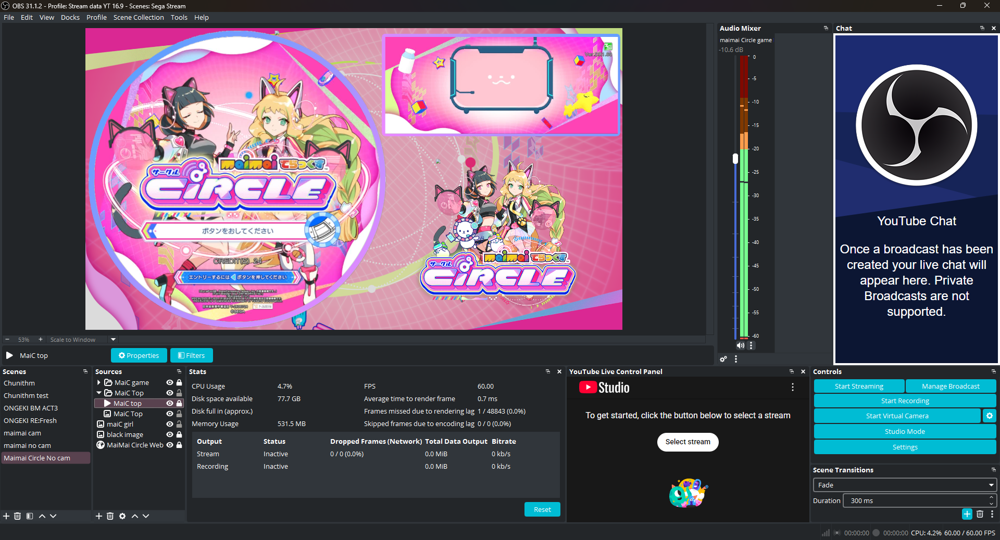

# How To Stream Arcade PC
So, after all, you want to stream your game? Show your skills and explain why *Chunithm Prism Memory* is the best game!  
But first, disclaimer /!\ KNOW WHAT YOU’RE DOING AND WHERE YOU STREAM!  
I’ll assume you’re playing on two PCs.  
I don’t provide any game links — dump your own data. I’m not responsible for what you do.

# Preface
- [How To Stream Arcade PC](#how-to-stream-arcade-pc)
- [Preface](#preface)
- [Requirements](#requirements)
- [Choose Between Local Stream or a Stream PC](#choose-between-local-stream-or-a-stream-pc)
- [OBS Capture vs Capture Card](#obs-capture-vs-capture-card)
- [Setup OBS](#setup-obs)
  - [Arcade PC](#arcade-pc)
    - [Arcade PC Settings](#arcade-pc-settings)
  - [Stream PC](#stream-pc)
    - [Stream PC Settings](#stream-pc-settings)
    - [Setup Source for UDP Stream](#setup-source-for-udp-stream)
- [Additional Tips](#additional-tips)
- [Troubleshooting](#troubleshooting)
- [Conclusion](#conclusion)

# Requirements
- Your arcade game must be able to run OBS and the game simultaneously.
- A good LAN connection.
- NVIDIA GPUs are preferred (optional).

# Choose Between Local Stream or a Stream PC
If your arcade PC can easily run both your game and your stream, you can do everything on one machine.  
However, I prefer using two PCs for several reasons:
- I’m not the only one playing on this cabinet. Each of us can stream using our own setup and control our own OBS.
- Easier control — your arcade PC just runs the game, and the rest is handled by your stream PC.
- Better performance when you don’t stream directly on your arcade PC (especially if you use a capture card).

# OBS Capture vs Capture Card
If you can afford a capture card for audio and video, go for it — it’s much better.  
But if you can’t, that’s fine! We can do it with a local stream alternative using OBS capture.  
This tutorial focuses on local streaming without a capture card.

# Setup OBS
Go to:  
``https://obsproject.com/en/``  
Install OBS on both PCs!

## Arcade PC
After installation, open OBS, close the `Auto-Configuration Wizard` window, and open the `Settings`.

### Arcade PC Settings
- Go to the `Output` tab. At the top, choose `Advanced` mode.  
  In the `Recording` section, set:
    - Type: `Custom Output (FFmpeg)`
    - FFmpeg Output Type: `Output to URL`
    - File Path or URL: `udp://239.255.0.1:3131?pkt_size=1316`
    - Container Format: `mpegts`
    - Video Bitrate: `10000 Kbps` (you can increase or decrease depending on your LAN connection, but don’t go below 10000 Kbps)
    - Rescale Output: `1920x1080` (depends on your game resolution — for example, *maimai* can use `1080x1920` if you only have one screen)
    - Video Encoder: `mpeg2video`
    - Audio Bitrate: `320 Kbps`
    - Audio Encoder: `mp2`
- Go to the `Video` tab:
    - Base (Canvas) Resolution: `1920x1080` (or `1080x1920` depending on your game)
    - Output (Scaled) Resolution: same as above
    - Common FPS Values: `60` (or match your game’s FPS)

Now, if you start recording, you’ll be streaming your game over your LAN! ☆*: .｡. o(≧▽≦)o .｡.:*☆  
(Don’t forget to launch your game **before** starting recording in OBS — click on the **Record** button, not **Stream**.)

## Stream PC
After installation, open OBS, close the `Auto-Configuration Wizard` window, and open the `Settings`.

### Stream PC Settings
- Go to the `Stream` tab.  
  Choose your preferred streaming platform and connect your account or paste your stream key.  
  (**Never share your stream key with anyone!!!**)
- Go to the `Output` tab. Choose `Advanced` mode. In the `Streaming` section:
    - Encoder: `NVIDIA NVENC H.264 (new)` (if you have an NVIDIA GPU)
    - Video Bitrate: `10000 Kbps` (depends on your upload speed and platform — e.g., Twitch max is 6000 Kbps)
    - Preset: `P5 slow (good quality)` (choose *Performance* if your PC is weak)
    - Profile: `High`
- In the `Audio` section:
    - Audio Bitrate: `320 Kbps`
- Go to the `Video` tab:
    - Base (Canvas) Resolution: `1920x1080` (or your preferred resolution)
    - Output (Scaled) Resolution: `1920x1080` (match your layout or orientation)
    - Common FPS Values: `60`
Close the settings.

### Setup Source for UDP Stream
- In the `Sources` section, click the `+` button and choose `Media Source`. Name it however you like (e.g., *Chuni Prism Memory Screen*).
- Uncheck the `Local File` checkbox.
- In the `Input` textbox, enter: `udp://@239.255.0.1:3131`
- Click OK.
- Resize and position the source as you like on your canvas.
- You can now add other sources such as webcam, images, text, alert boxes, etc.  
Example of how my OBS looks for my stream:  

# Additional Tips
- On your arcade PC, hide the preview window to improve performance.  
  
- If you want to talk with your viewers, plug a microphone into your stream PC and set it up in OBS.  
  Use headphones to avoid feedback loops.  
  Also, lower your arcade PC’s audio to balance with your mic for a better experience.
- You can automate OBS on your arcade PC with this shortcut to start directly:  
  `"C:\Program Files\obs-studio\bin\64bit\obs64.exe" --startrecording --startminimized`

# Troubleshooting
- If your stream is laggy, lower the video bitrate on your arcade PC and/or stream PC depending on your LAN and internet connection.
- If you get a black screen on your stream PC, check the firewall on your arcade PC.
- If your game lags, you can try using NDI instead of UDP stream — but you’ll need a good LAN for that.  
  (Normally it’s fine; I play on a very low-end PC and my game doesn’t lag.)  
  
- If you have audio/video desync, increase the buffer size in the Media Source properties on your stream PC.
- If you add a webcam and notice delay, apply an offset to the webcam source to sync with gameplay.

# Conclusion
If you follow this tutorial, you can now stream your arcade games easily — just like I do! ☆*: .｡. o(≧▽≦)o .｡.:*☆  
Maybe it’s not the perfect method, but it’s cheap and easy to set up.  
However, if you have the budget, a capture card is still the best option!
