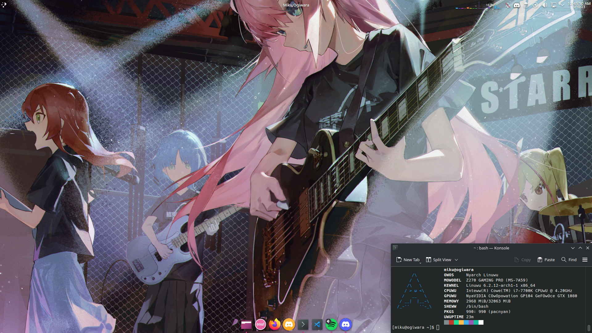

# Preface

- [Preface](#preface)
- [My story of using Linux](#my-story-of-using-linux)
- [Why I tried to switch to Linux](#why-i-tried-to-switch-to-linux)
- [My setup](#my-setup)
- [Post-install and problems I faced](#post-install-and-problems-i-faced)
  - [Xorg and Wayland...](#xorg-and-wayland)
  - [Genshin Impact](#genshin-impact)
  - [Audio?](#audio)
  - [Latte](#latte)
- [I HATE COMPUTERS](#i-hate-computers)
- [FUCK IT](#fuck-it)
- [Conclusion](#conclusion)

# My story of using Linux

I started using Linux for the first time in **2014**.  
My first Linux distro was **Ubuntu 14.04**.  
After that, I kept using it for about 2 years. In 2016, I switched to **Debian**, before starting to use **Arch** in 2019.

For a long time, I had a **dual boot** with Arch and Windows.  
My old laptop had only Arch Linux (it has now been replaced by a **MacBook Air M1**).

  
*A screenshot of my old install on my PC and laptop something I want to recreate on my new setup.*

---

# Why I tried to switch to Linux

Well, **DO YOU KNOW WINDOWS** :)))))))))  
Windows 11 is a piece of shit.  

Sometimes my audio just breaks (remember that for later), it doesn’t turn off or reboot properly, and it has random performance issues for no reason.  
I wanted to switch to something without all this “AI OS” nonsense.

---

# My setup

My PC has:

- Ryzen 7 5800X  
- GTX 1080  
- 2 M.2 drives  
- 2 hard drives  
- 2 SSDs  
- an external sound card (**AUDIOBOX USB 96**)  

I started my Linux journey by clearing one of the SSDs to install Arch.  
I couldn’t delete Windows because I still play some games that *CAN’T RUN ON LINUX*.  

So I did a basic Arch install with **KDE** and **Xorg**, and that’s where the problems started...  

Sorry, I forgot to take screenshots because I didn’t think I’d end up writing something about my Linux issues, lmao.

---

# Post-install and problems I faced

## Xorg and Wayland...

After installing and rebooting, I started KDE wow, **KDE 6** is a big change from my previous installation.  
So I began installing my usual stuff, but then I noticed some issues.

The first one: **WTF, why is it so laggy???**  
Every single time I opened or closed a window, my computer froze for 2 seconds.  

After a LOT of searching, it turned out to be a **Xorg issue** :).  
So I had two options:

- Fuck Xorg and try Wayland  
- Nvidia FUCK YOU  

After about 20 minutes, I decided to switch to Wayland and... oh shit... performance was perfect.  

But for some reason, my monitor’s colors were *really dull* like when you set Windows’ digital vibrance to -40%.  
(And for reference, I usually set it to +80 on Windows because I love saturated colors.☆*: .｡. o(≧▽≦)o .｡.:*☆)  

So my new goal became: **FIND HOW TO INCREASE THIS** :)))  
And the most funny thing... YOU CAN'T. Yes somethings You can do on WINDOWS 95 is just not available on WAYLAND ?? 

I also couldn’t set my monitor to **144Hz**, it was exhausting, and there were other small bugs.  
Spoiler: after 1 hour, I gave up completely and removed Wayland to go back to Xorg.

After some research, I found that the freezing was caused by the **new KDE 6 taskbar** removing one effect fixed everything perfectly. yeah...

---

## Genshin Impact

Perfect, it was **14:00**, time to do my **Genshin Impact dailies**.  
I used [this custom launcher](https://github.com/an-anime-team/anime-games-launcher), and it worked *very well*.  

I was able to install and play easily, except that the **120 FPS mod** didn’t work for some reason.  
I didn’t investigate further though.

---

## Audio?

Because what’s a computer without sound, right?  

My sound card “worked” after installing **Pipewire**, BUT the sound only came from one ear and was very weak.  

I found some commands, and now I had sound on both sides plus that *beautiful noise* :)  

<video controls width="100%" preload="metadata" playsinline>
  <source src="/Fuwari/asset/TryToswitchToLinux/audiofail.mp4" type="video/mp4">
</video>

And I just never found how to fix that crap.  
The only thing I could do was keep the volume at **30% max**.

---

## Latte

**Latte Dock** is the dock I used to personalize and set up my KDE.  
That’s what made my KDE look so NICE (~~and totally macOS-like lol~~).  

But **KDE 6** removed a component used by Latte, which basically broke every KDE customization package.  
So no Latte :(  

KDE 6 added more customization for everything, so I tried it AND IT SUCKS.  
Some elements refuse to move, you can’t have full transparency, and it’s like Word: you move one thing and everything else just jumps to random places.

---

# I HATE COMPUTERS

OK NOW HERE’S THE FUN PART.  

At home, I have a **NAS** using my ISP’s router (and it’s a GREAT router, thanks **Free** — French ISP).  
So I did the classic way: opened **Dolphin**, saw my drives on the left, clicked on “Network”... and nothing happened. COOL.  

So I looked up WHY, tried a bunch of stuff, and the reason... sucked.  

Basically, **SMB1 isn’t supported** by the Freebox (my router), BUT **Dolphin only wanted to use SMB1** :) COOL.  

So I checked how to set up **SMB2/3** for Dolphin... well, I had to create an **fstab table**, put credentials in a fucking TXT file, and after another painful moment I forgot...  
But FINALLY I could access my NAS.  

**5 hours later. FUCK IT.**

---

# FUCK IT

I’m done. FUCK it, it’s too much for me.  
And I haven’t even talked about all the other issues.  

After **4 days** of trying to make my PC work, I gave up and formatted the SSD.

---

# Conclusion

The ending was pretty bad, but I’m **not done with Linux**.  

I’m writing this **2 months later**, and I’ve found a lot of resources that could help me.  
And Microsoft keeps making Windows worse every day.  

I plan to try switching back to Linux later — but **fuck KDE**.  
KDE 6 is really bad.  

Next time, I think I’ll use **Hyprland**... yay, rice time lol.  
And no, I **WILL NEVER USE GNOME**, I hate it so much...  

So maybe a new chapter for this arc?

---
