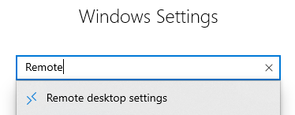
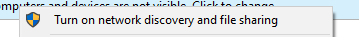

# How I proceed to install Windows 10 LTSC

Before starting, we need some context.

When you want to run an arcade game in perfect condition, you need a version of Windows with fewer services and bloat. That's why I install Windows LTSC.  
I don't provide any game links. Dump your own data. I'm not responsible for what you do.

---
# Preface
- [How I proceed to install Windows 10 LTSC](#how-i-proceed-to-install-windows-10-ltsc)
- [Preface](#preface)
- [Windows Installation](#windows-installation)
- [Post install](#post-install)
- [Activation](#activation)
- [Post setup](#post-setup)
  - [RDP](#rdp)
    - [Enable RDP](#enable-rdp)
    - [Allow connection without password](#allow-connection-without-password)
    - [Connect on RDP](#connect-on-rdp)
  - [Shared folder](#shared-folder)
    - [Setup a sharded folder](#setup-a-sharded-folder)
    - [How to connect](#how-to-connect)
  - [Game Start on boot](#game-start-on-boot)
  - [Tiny optimization](#tiny-optimization)
- [Trobulshoting](#trobulshoting)
  - [User name (sega game)](#user-name-sega-game)
  - [share permition](#share-permition)
  - [Can't find The shared folder on Windows](#cant-find-the-shared-folder-on-windows)
---
# Windows Installation 

We need to download an ISO. For that, go to :

```
https://massgrave.dev/windows_ltsc_links
```

and choose "Windows 10 LTSC 2021". 

Burn the ISO on usb stick and start a classic windows installation.

When the Windows setup asking you for the version off Windows, choose "Windows 10 Entreprise LTSC".


After this textbox, you can proceed with a basic Windows installation. Once it's done, we need to set up some stuff. Don't forget to unplug your internet connection to be able to create a local Windows account.  
If you don't want to have a password on your session for easier boot, just leave the password prompt blank.

---

# Post install

First, install your graphics driver, internet driver (if you're using Wi-Fi), VC Redist, DirectX, and optional drivers (like card reader).
```
https://nvcleanstall.net/download
https://github.com/abbodi1406/vcredist
https://www.microsoft.com/en-us/download/details.aspx?id=8109
```

---

# Activation

Now we need to activate Windows. If you have a legit key, just use it. If you don't, that's fine. Open a PowerShell and paste this:

```
irm https://get.activated.win | iex
```

If you want to see wath this commande do you can check on the [Massgrave web site](https://massgrave.dev/)


On this windows press "1" and your windows is activated ! 

---

# Post setup

In this part, we will configure Windows,

- RDP 
- Shared folder
- Game start on boot 
- Tiny optimization 

---
## RDP
Remote Desktop Protocol or RDP is a protocol that allows remote access and control of a computer. I use the default one on Windows — works great, stable, and easy to use. But you can install another one if you don't like it, like Anydesk or TeamViewer.

### Enable RDP

Open Windows Settings and search for "Remote Desktop" and go to it. Click to enable Remote Desktop.  



### Allow connection without password

Open "Local Group Policy". Go to:  
"Windows Settings" > "Security Settings" > "Security Options" >  
"Accounts: Limit local accounts use of blank passwords to connect" > **Disabled**  
Then apply and exit.   


### Connect on RDP
On your computer, search for RDP and open it. A window asks you to enter the computer name — you can find it in the "Remote Desktop settings" on your arcade PC if you don't know it.  
Enter the name and click "Connect".  
You'll get a prompt asking for credentials — enter your account name and password (or leave blank if you don't have one), then click OK.  
Now you are connected to your arcade PC remotely!  


---
## Shared folder
Useful for updating your game without touching your arcade PC
### Setup a sharded folder 
Right-click the folder you want to share and go to:  
Properties > Sharing > Share > Share  


Open Control Panel and go to:  
Network and Internet > Network and Sharing Center > Advanced sharing settings
Apply the following settings


Open a new File Explorer tab and click on the "Network" tab.  
Click the top banner "Network discovery is turned off..." and click "Turn on network discovery and file sharing".  
Click "Yes". 




You should now see your arcade PC on your local network in the "Network" tab. If is not the case please refere to [Can't find The shared folder on Windows](#cant-find-the-shared-folder-on-windows).


### How to connect 
Click on it to connect — you'll get a prompt asking you to enter your credentials.  
Just enter the account name from the arcade PC, and if you didn’t set a password, leave the password field blank.  


Now you can see your folder ! 


---
## Game Start on boot 
First, make sure your game can start without any user interaction.  
Open your game folder and find your `start.bat` or `.exe` file. Right-click it and copy.  
Press "Windows + R" on your keyboard and type `shell:startup`.  
In this folder, right-click and "Paste shortcut".  

Now your game will start automatically on Windows boot.  


---
## Tiny optimization 
Not much to do here — Windows LTSC is mostly clean by default. Just avoid installing lots of unnecessary software on your arcade machine.  
If you're using an HDD and it's slow, you can disable Windows Indexing and Windows Search for better read performance.  
If your game is really slow to boot, try excluding its folder from Windows Defender.

---
# Trobulshoting
Here we talk about some common issues you may encounter.

## User name (sega game)  
Sega games don't work if your computer or local account is named like the game.  
Don't name your PC or account: `maimai`, `Chunithm`, `Ongeki`, etc.

## share permition
Make sure you have allowed "read and write" access for everyone, if you're not using local account credentials.

## Can't find The shared folder on Windows
A common issue with shared folders. The easiest way to connect is:  
Open the Windows Start menu and manually search for the folder like this: `\\Your-PC-Name`  

Press Enter, and you should access your shared folder.  
If it's still not working, try entering the local IP address of the computer.

---